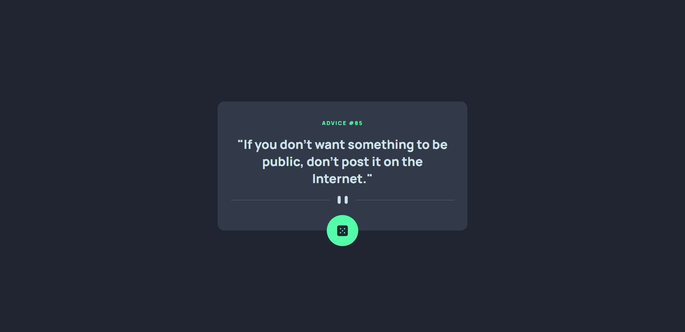
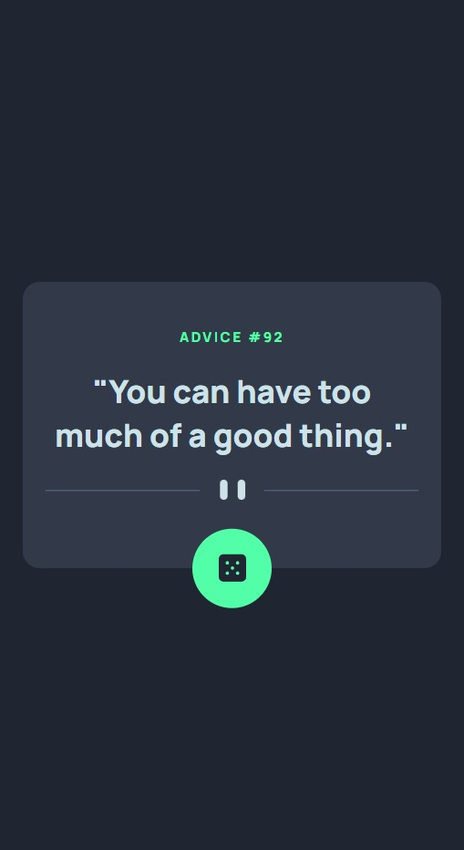

# Frontend Mentor - Advice generator app solution

This is a solution to the [Advice generator app challenge on Frontend Mentor](https://www.frontendmentor.io/challenges/advice-generator-app-QdUG-13db). Frontend Mentor challenges help you improve your coding skills by building realistic projects.

## Table of contents

- [Overview](#overview)
  - [The challenge](#the-challenge)
  - [Screenshot](#screenshot)
  - [Links](#links)
- [My process](#my-process)
  - [Built with](#built-with)
  - [What I learned](#what-i-learned)
  - [Continued development](#continued-development)
- [Author](#author)

## Overview

### The challenge

Users should be able to:

- View the optimal layout for the app depending on their device's screen size
- See hover states for all interactive elements on the page
- Generate a new piece of advice by clicking the dice icon

### Screenshot




### Links

- Solution URL: [https://github.com/NguyenVanKhoa-CDTH19PMC/advice-generator-app.git](https://github.com/NguyenVanKhoa-CDTH19PMC/advice-generator-app.git)
- Live Site URL: [https://nguyenvankhoa-cdth19pmc.github.io/advice-generator-app/](https://nguyenvankhoa-cdth19pmc.github.io/advice-generator-app)

## My process

### Built with

- Semantic HTML5 markup
- CSS custom properties
- Flexbox
- Mobile-first workflow
- Javascript

### What I learned

Fetch API to Get Data and Asynchronous processing

```js
async function fetchAdvice() {
  let advice = new Advice();
  let response = await fetch("https://api.adviceslip.com/advice");

  console.log(response.status); // 200
  // console.log(response.statusText); // OK

  if (response.status === 200) {
    let data = await response.text();

    // handle data

    return (advice = new Advice(
      JSON.parse(data).slip.id,
      JSON.parse(data).slip.advice
    ));
  }
}
```

### Continued development

Improve HTML, CSS and JavaScript skills

## Author

- Frontend Mentor - [@NguyenVanKhoa-CDTH19PMC] (https://www.frontendmentor.io/profile/NguyenVanKhoa-CDTH19PMC)
- Github - [NguyenVanKhoa-CDTH19PMC] (https://github.com/NguyenVanKhoa-CDTH19PMC)
